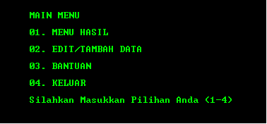
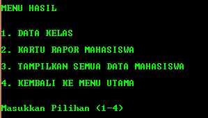
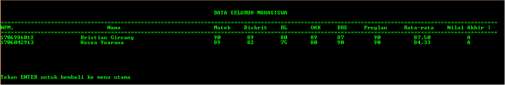
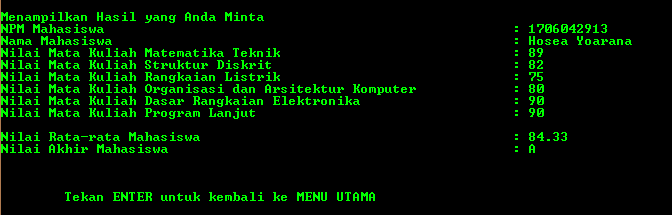
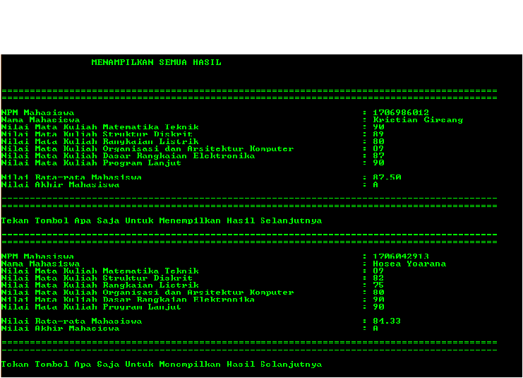
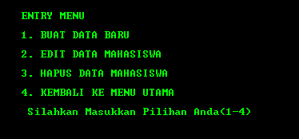
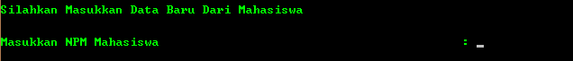
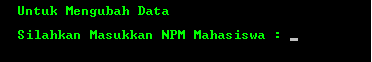
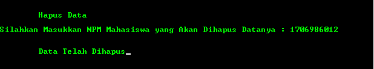
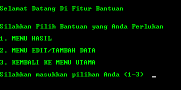

# STUDENT DATABASE                                                                                                              
## DESCRIPTION
STUDENT DATABASE, sesuai dengan namanya adalah program berbasis C yang bertujuan membuat dan/atau memanipulasi database dengan mudah. Program ini ditujukan kepada Guru/Dosen yang selalu membuat database siswa/Mahasiswa-nya. Program ini dibuat berdasarkan "Microsoft Excel" dalam pikiran, sehingga tidak sedikit fitur yang memiliki kesamaan dengan yang ada pada Excel. Dalam program sudah terdapat template mata kuliah creator saat ini, untuk saat ini pengubahan nama mata kuliah dapat diubah di dalam source code yang diberikan.
<a href="visuals">This is a link</a>
## VISUALS

## INSTALLATION
Download salah satu dari kedua pilihan yaitu source code(advance user) / .exe

  System Requirements : Windows

  Jika anda mendownload .exe :
1. Masuk ke lokasi/folder tempat anda menyimpan download
2. Jalankan program dengan klik 2x pada file .exe(not recommended) / klik kanan file .exe -> run as administrator -> yes(recommended)
3. ENJOY!

  Jika anda mendownload source code C :
  <ol>
<li>Buka C/C++ compiler(ex : DevC++)</li>
<li>Buka source code yang telah di download</li>
<li>Compile&Run source code</li>
<li>ENJOY!</li>
</ol>
 
## USAGE
<ol>
<h3><li>Tampilan Halaman Depan</h3></li>

  

<h3><li>Menu Hasil</h3></li>
  Terdapat 3 pilihan dalam menampilkan data yang telah di input pada menu Tambah/Ubah Data(No.3)
  

  

	
1. Data Kelas

	

  
  

  Seluruh data yang ada akan ditampilkan dalam satu tabel yang rapi
	
  
2. Kartu Rapor Mahasiswa

  

  
  

  Menampilkan data mahasiswa dengan mencari NPM(*harus sesuai) yang ada dalam data
	
  
3. Tampilkan Semua Data Mahasiswa

  

  

  Menampilkan data mahasiswa satu persatu, klik enter untuk menuju ke data selanjutnya

<h3><li>Tambah/Ubah Data</h3></li>
	Terdapat 4 pilihan dalam menambahkan/mengubah data yang nantinya akan di tampilkan pada Menu Hasil(No.2)
  

  
  

  
1. Buat Data Baru

  

  

	   Menginput data yang di inginkan ikuti langkah dalam bantuan jika mengalami masalah
	
  
2. Edit Data Mahasiswa

  

  

	   Mengedit data yang telah tersimpan dalam program dengan memasukkan NPM(*harus sesuai)
  
3. Hapus Data Mahasiswa

  

  

	   Menghapus data yang telah tersimpan dengan menginput NPM(*harus sesuai)

<h3><li>Bantuan</h3></li>

  

	Menu untuk mengetahui lebih lanjut dalam penggunaan program
</ol>
*harus sesuai berarti NPM yang dicari harus ada dan sama dengan NPM yang di input

## SUPPORT

hoseayoarana@gmail.com

kristiangirsang007@gmail.com

## AUTHORS AND ACKNOWLEDGMENT

Kristian Girsang

Hosea Yoarana 1706042913

## LICENSE
Free Source Code

## PROJECT STATUS
Alpha

## FAQ
1. 
Q : Apakah Program dapat saya ubah sesuai keinginan saya?

     
A : Tentu, program ini adalah Free Source Code

2. 
Q : Bagaimana saya dapat mengganti nama mata kuliah?

    
A : Untuk advance user dapat mengubahnya secara langsung pada source code
         Untuk non-advance user akan di implementasikan pengubahan nama mata kuliah di release yang akan datang

3. 
Q : Saya mengalami masalah tertentu pada program atau saya mendapati beberapa bug pada program, dimana saya harus melaporkannya?

    
A : Berbagai macam laporan dapat di kirimkan ke bagian SUPPORT di atas

4. 
Q : Bagaimana saya dapat berkontribusi dalam project ini?

    
A : Kirimkan pesan ke email yang tertera di SUPPORT

## CHANGELOG

Alpha 1.0 : Publish

Alpha 1.1 : Implementasi password untuk mengakses program

